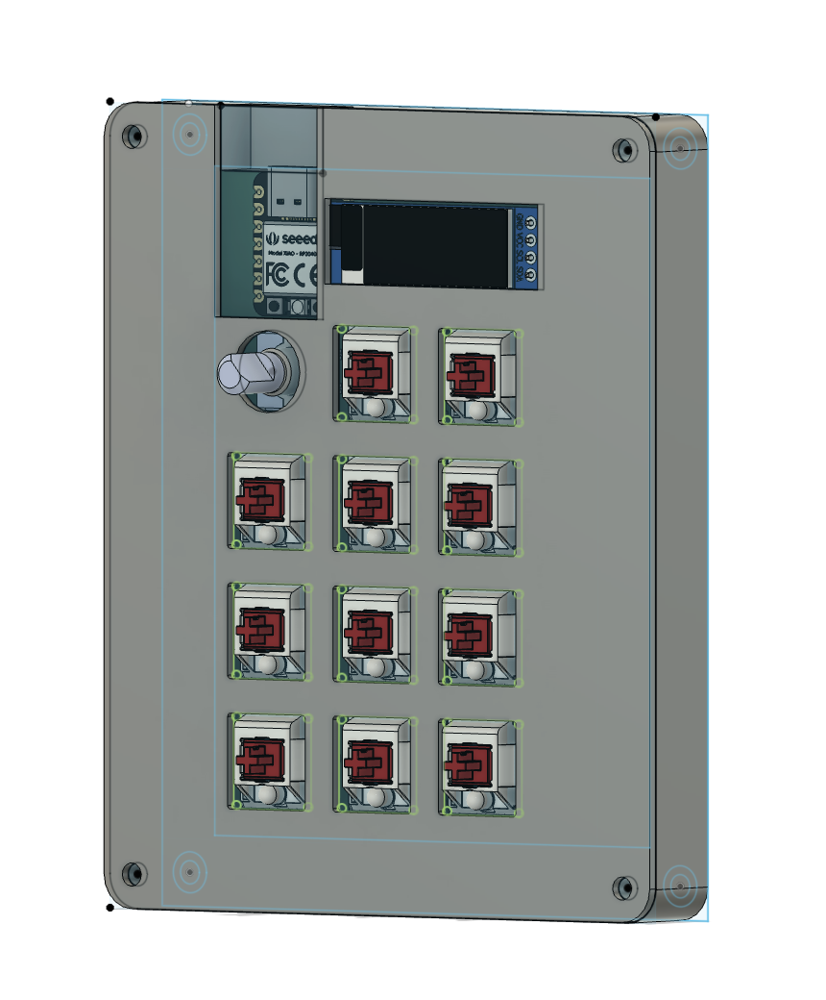
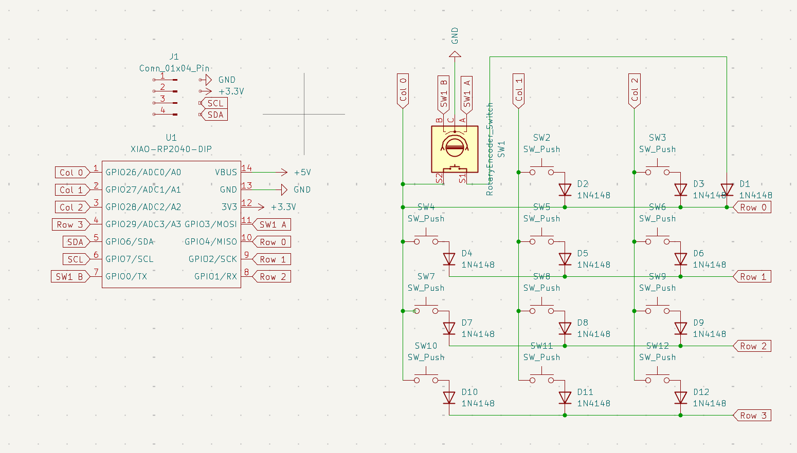
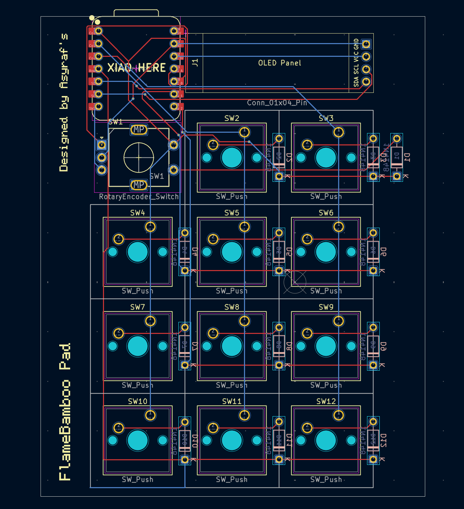

# Flamebamboo Pad

### Features

This is a 11 key macropad with a rotary encoder, an OLED Display that uses KMK firmware (for now)

### Inspirations

Recently I started my content creation journey on the internet where I document my game, app development journey. While I was making this project I decided to make a vlog to document everything from Day 1, making the schematic, pcb, 3D modelling. My content hasn't been consistent but I try my best to post daily. Overall its been 19 days since I started this project back in June 1st (there's some days I didn't work on it).

[Day 2 of building a macropad vlog instagram](https://www.instagram.com/reel/DKhWUYOze7S/)

[Day 2 of building a macropad youtube](https://youtube.com/shorts/7tvncrJ1KWo?si=Fv6e_nwCdUAoQ5EQ)

Feel free to DM me on Slack if you have any feedback or suggestions for improvements! Follow along to see my other content!

## Bill of Materials (BOM)

| Qty | Name                       |
| --- | -------------------------- |
| 12  | 1N4148 diodes              |
| 11  | Cherry MX switches         |
| 1   | 128x32 I2C OLED screen     |
| 1   | EC11 rotary encoder + knob |
| 1   | PCB                        |
| 1   | Seeed Studio XIAO RP2040   |
| 4   | M3x16mm screws             |
| 4   | M3 Heatset                 |
| 11  | Blank DSA white keycaps    |
| 1   | Case top and bottom        |

## CAD Model

## Schematic

## PCB

